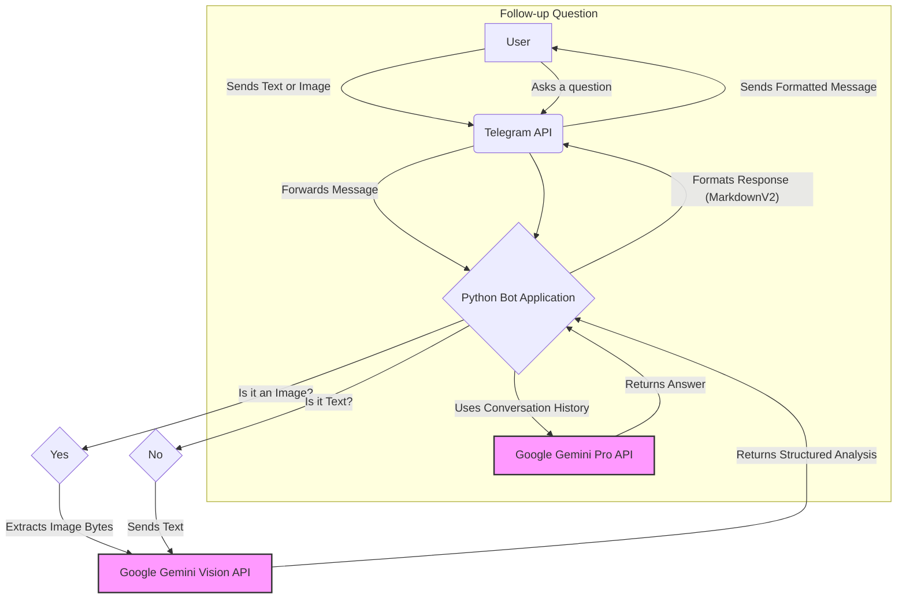
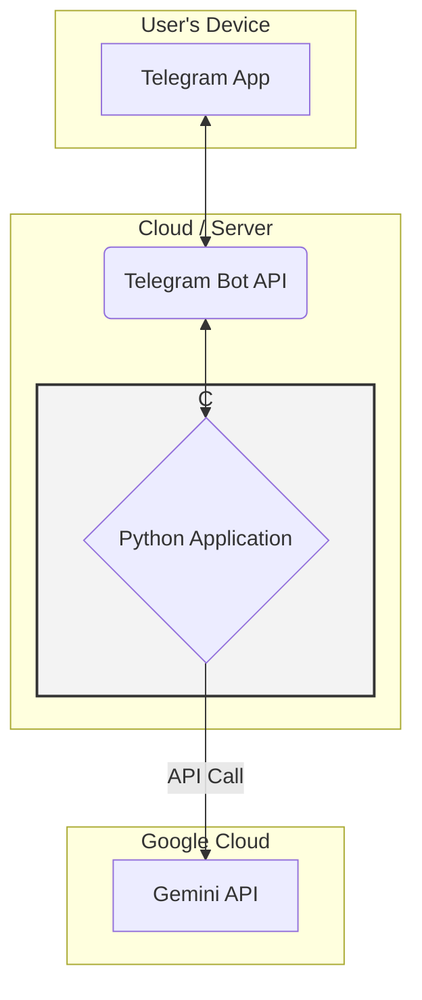

# Japanese Language Analyzer Telegram Bot

[](https://www.python.org/downloads/release/python-3110/) [](https://opensource.org/licenses/MIT)

A sophisticated Telegram bot designed to help users learn and understand the Japanese language. Send any Japanese sentence or an image containing Japanese text, and the bot will provide a comprehensive analysis.

  <!-- Placeholder: You can create a GIF to demonstrate the bot's functionality -->

## 🌟 Introduction

The Japanese Language Analyzer Bot is a powerful tool for anyone studying Japanese. Whether you've encountered a sentence you don't understand or want to deconstruct the grammar and vocabulary of a phrase, this bot is your go-to companion. It uses Google's advanced Gemini models to "read" images and understand text, providing a structured and easy-to-understand analysis directly in your Telegram chat.

## ✨ Features

-   **Text Analysis**: Send a Japanese sentence and get a complete breakdown.
-   **Image Analysis (OCR)**: Snap a photo of a menu, book, or sign, and the bot will extract and analyze the Japanese text.
-   **In-depth Explanations**: Each analysis includes:
    -   **Extracted Japanese Text**: The text identified from your message or image.
    -   **English Translation**: A clear and accurate translation.
    -   **Vocabulary Breakdown**: A list of key vocabulary with readings, parts of speech, and meanings.
    -   **Grammar Analysis**: A concise explanation of the grammatical structures used in the sentence.
-   **Conversational Follow-ups**: Ask follow-up questions about the analysis to deepen your understanding.
-   **Dockerized**: Easy to set up and run in a containerized environment.

## ⚙️ How It Works (User Flow)

The interaction between the user, the bot, and the backend services is designed to be seamless. The bot handles both text and image inputs and maintains a short-term memory for follow-up questions.



## 🏗️ Architecture

The application is built with a simple yet powerful architecture, connecting the Telegram Bot API to the Google Gemini API through a Python backend. The entire application is containerized using Docker, ensuring consistency across different environments.



-   **Telegram Bot**: Serves as the user interface, handling all incoming messages and sending back the formatted analysis.
-   **Python Application**: The core of the bot. It uses the `python-telegram-bot` library to communicate with Telegram and the `google-generativeai` library to interact with the Gemini API. It also contains the logic for formatting the final response.
-   **Google Gemini API**: The AI model that performs the heavy lifting of text extraction (from images), translation, and linguistic analysis.

## 🛠️ Technology Stack

-   **Backend**: Python
-   **Telegram Bot Framework**: `python-telegram-bot`
-   **AI Model**: Google Gemini Pro & Gemini Pro Vision
-   **Containerization**: Docker
-   **Dependencies**: `google-generativeai`, `python-dotenv`, `Pillow`

## 🚀 Setup & Usage

### Prerequisites

-   Python 3.11+
-   Docker
-   A Telegram Bot Token ([learn how to get one](https://core.telegram.org/bots#6-botfather))
-   A Google Gemini API Key ([get one from Google AI Studio](https://makersuite.google.com/))

### 1. Configuration

1.  **Clone the repository:**
    ```sh
    git clone <your-repository-url>
    cd <your-repository-name>
    ```

2.  **Create and configure the `.env` file:**
    Create a file named `.env` in the root directory of the project and populate it with your credentials.

    ```ini
    # .env
    TELEGRAM_BOT_TOKEN="YOUR_TELEGRAM_BOT_TOKEN"
    GEMINI_API_KEY="YOUR_GEMINI_API_KEY"

    # Optional: You can change the models if needed
    GEMINI_VISION_MODEL="gemini-pro-vision"
    GEMINI_TEXT_MODEL="gemini-pro"
    ```

### 2. Running with Docker

The simplest way to run the bot is with Docker.

1.  **Build the Docker image:**
    ```sh
    docker build -t japanese-analyzer-bot .
    ```

2.  **Run the Docker container:**
    ```sh
    docker run --env-file .env -d --name japanese-bot japanese-analyzer-bot
    ```

The bot is now running! Open Telegram and start a conversation with it.

### 3. (Alternative) Local Python Environment

If you prefer not to use Docker, you can run the application in a local Python environment.

1.  **Install the dependencies:**
    ```sh
    pip install -r requirements.txt
    ```

2.  **Run the bot:**
    ```sh
    python -m src.bot
    ```

## 💬 Example Interaction

**User sends an image containing the text: 「猫はかわいいですね。」**

**Bot's Response:**

> **Extracted Japanese Text**
> 猫はかわいいですね。
>
> **English Translation**
> Cats are cute, aren't they?
>
> **Vocabulary Breakdown**
> **猫** (ねこ) - Noun: Cat
> **は** - Particle: Topic marker
> **かわいい** - i-adjective: Cute, lovely
> **です** - Auxiliary Verb: Polite copula (is/are)
> **ね** - Particle: Sentence-ending particle, seeking agreement
>
> **Grammar Analysis**
> 1.  **AはBです (A wa B desu)**: This is a fundamental sentence structure, meaning "A is B". Here, it establishes "Cat" as the topic.
> 2.  **ね (ne) Particle**: This particle is added to the end of a sentence to confirm information or seek agreement from the listener, similar to saying "..., right?" or "..., isn't it?" in English.
